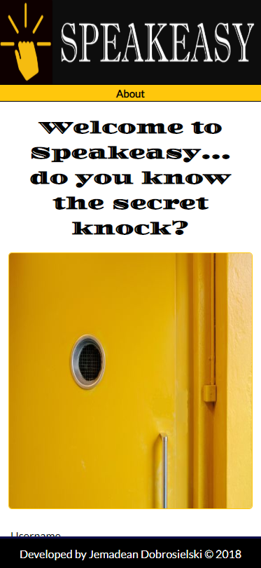
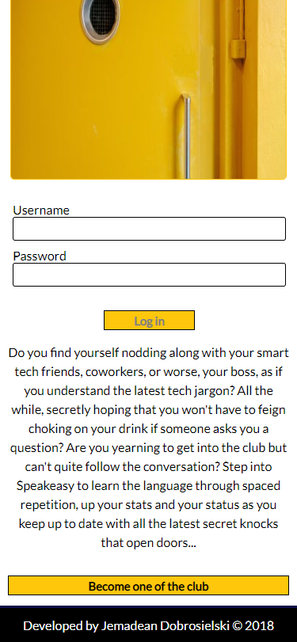
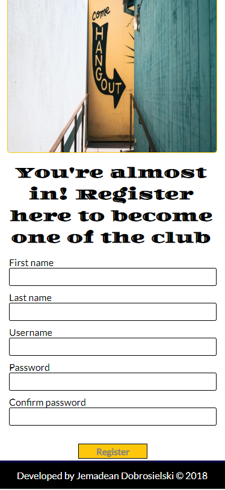
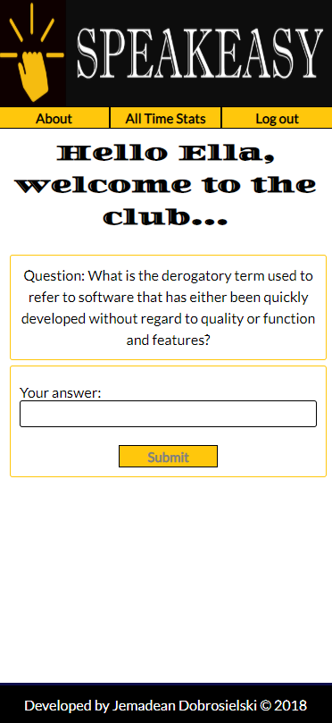
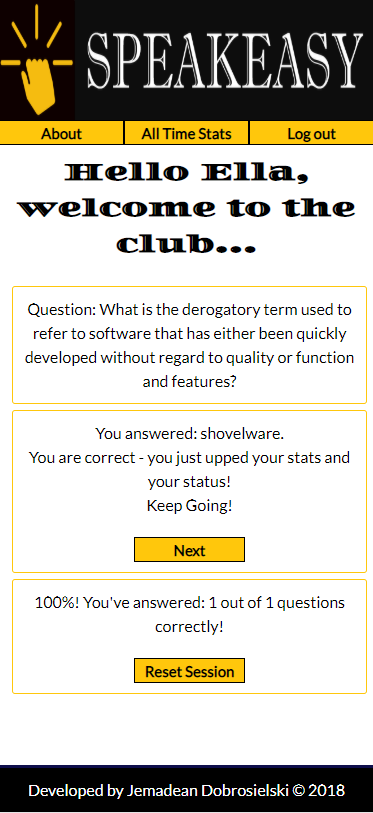
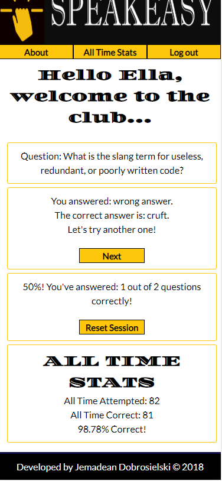

![Speakeasy Logo][logo]

[logo]: img/speakeasy-logo2.png

Do you find yourself nodding along with your smart tech friends, coworkers, or worse, your boss, as if you understand the latest tech jargon? Step into Speakeasy to learn the language through spaced repetition, up your stats and your status as you keep up to date with all the latest secret knocks that open doors... **_[Become one of the club here](https://speakeasy-client-two.herokuapp.com "Speakeasy")_**&nbsp;

#### Demo account:
##### username: ellafitzgerald
##### password: ellafitzgerald

## Feature List
 * Users are first taken to an introductory landing page where they can login or register.
 * Users can learn what to expect by clicking About, which is available before login and while logged in.
 * Users will be automatically logged in upon successful account creation, and once logged in they are taken to their dashboard, where they will be presented with a question and a place to submit their answer.
 * Upon submission of an answer, users will receive immediate feedback letting them know if they were correct. If not, they will be given the correct answer so they can learn it. Users can move to the next question when they are ready by clicking Next.
 * Users will see their Session Stats as they are answering questions, and they can reset their stats for the session.
  * Users can see or hide their All Time Stats (their stats since account creation) by clicking All Time Stats.  These stats are updated as each question is answered.
 * Users are presented questions using a spaced repetition algorithm.  When a question is answered correctly, the time interval before it is seen again increases.  When a question is answered incorrectly, the user will see the question again after the next question.

## Screenshots
|  |  |  | 
|:---:|:---:|:---:|
| Landing Page | Login | Registration |

|  |  |  |
|:---:|:---:|:---:|
| Question | After Answer Submission | After Incorrect Answer Plus All Time Stats |

## Tech Stack:
### Frontend

  * HTML5
  * CSS3
  * JavaScript
  * React
  * Redux
  * Deployed to Heroku

### Backend

  * Node/Express
  * MongoDB/Mongoose/mLab
  * JWTs for authentication
  * Deployed to Heroku

This is the backend for this app.  **_[The frontend can be found here.](https://github.com/JemDobro/Speakeasy-client-Jem "Speakeasy Frontend")_**

## Key Components
 * All components live in the src directory. 
 * The app houses the Header Bar, Landing Page, Dashboard, Logged Out and Footer components. 
 * The Landing Page houses the Info (About), Login Form, and Registration Form components. 
 * The Dashboard houses the Info (About), Question, Answer, Session Stats, and All Time Stats components.
 * The Answer component houses the Answer Submit Form and the Feedback components.